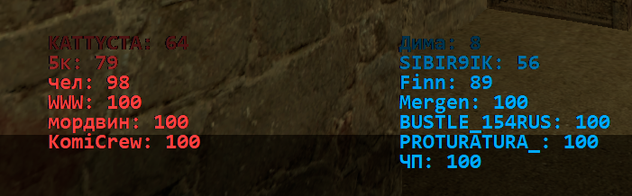

# source-engine-css-enhancer
# [EN]
***Author***: **Madness (null138)** | [Steam Profile](http://steamcommunity.com/profiles/76561198098349799)

[CS:S] Counter-Strike: Source Enhancer (CS:S Enhancer)

**CS:S Enhancer is an open‑source** Python tool that improves Counter‑Strike: Source gameplay by adding useful features and applying critical in‑game fixes.

**It designed to be fully safe and VAC‑friendly. It does not inject into the game process, does not write to or patch game memory, and does not modify the game executable. It only uses features available to ordinary players and operates by reading and editing text files the game already produces or consumes (for example logs and config files).**

***If you have any suggestions or ideas for new features, feel free to contact me. You can reach me via my Steam profile.***

# Ready features

***[ZE] Map action Countdown HUD***:
- Starts a real‑time countdown on screen whenever a map triggers a timed action.
- Supports **multiple independent timers** — new timers appear **below the previous ones**, each running separately and updating in real time.
- Fully **customizable screen position** — choose where the countdown appears on your display.
- Adjustable **text color** and style for better visibility and personalization.

***[ANY] Player info overlay***:
- Displays players names and health on screen and ranks players from lowest → highest health for both teams in real time. Works even while you are alive — purely a gameplay feature exposed by the game.
- Fully **customizable screen position** — move the overlay anywhere on your screen.
- Adjustable **player count per team** — show as many (or few) top players as you want.
- You can **enable or disable each team separately**, for example, show only Counter-Terrorists or only Terrorists.

***[ANY] Spray crash prevention***:
- Detects and removes crashing sprays uploaded by other players, preventing those sprays from crashing your client. (Note: a new exploit was discovered by the project author that some servers cannot protect against — this feature protects the local client.)

# Partially ready

***[ANY] Fake / Mirror server remover (full code for both host and local tool are ready)***:
- Removes fake or redirecting servers from your in‑game server browser. This feature requires a trusted central feed to detect and blacklist those servers accurately.

**To make the Fake/Mirror server remover fully functional we need a trusted, reliable host to run the central scanning script that:**

**Queries the Steam master server(s) for every active servers.**

**Detects fake/redirecting servers in real time and uploads them as list.**

**Publishes a verified blacklist feed (API or JSON) that local CS:S Enhancer instances can consume in real time.**

# [RU/РУССКИЙ]
***Автор***: **Madness (null138)** | [Профиль Steam](http://steamcommunity.com/profiles/76561198098349799)

[CS:S] Counter-Strike: Source Enhancer (CS:S Enhancer)

**CS:S Enhancer — это инструмент с открытым исходным кодом**, написанный на Python, который улучшает игровой процесс Counter-Strike: Source, добавляя полезные функции и применяя критические исправления игры.

**Он создан как полностью безопасный и VAC-дружественный. Он не внедряется в процесс игры, не записывает и не изменяет память игры, а также не модифицирует исполняемый файл игры. Он использует только функции, доступные обычным игрокам, и работает, читая и изменяя текстовые файлы, которые игра уже создаёт или использует (например, логи и конфиги).**

***Если у вас есть пожелания или идеи по новым функциям, можете смело обращаться ко мне. Связаться со мной можно через мой профиль Steam.***

# Готовые функции

***[ZE] Map action Countdown HUD***:
- Запускает **реальный таймер обратного отсчёта** на экране каждый раз, когда карта активирует таймерное событие.
- Поддерживает **несколько независимых таймеров** — новые таймеры появляются **под предыдущими**, каждый работает отдельно и обновляется в реальном времени.
- Полностью **настраиваемое положение на экране** — выберите, где именно будет отображаться таймер.
- Настраиваемый **цвет и стиль текста** для лучшей видимости и персонализации.

***[ANY] Player info overlay***:
- Отображает **имена игроков** и их **здоровье** на экране, сортируя их от самого низкого к самому высокому здоровью для обеих команд в реальном времени. Работает даже когда вы живы — это чисто внутриигровая функция, оставленная разработчиками.
- Полностью **настраиваемое положение на экране** — перемещайте оверлей в любое место.
- Регулируемое **количество игроков на команду** — показывайте столько топ-игроков, сколько хотите.
- Можно **включить или отключить любую из команд**, например, отображать только контр-террористов или только террористов.

***[ANY] Spray crash prevention***:
- Обнаруживает и удаляет крашащие спреи, загруженные другими игроками, предотвращая вылет клиента.  
  (Примечание: автором проекта был обнаружен новый эксплойт, от которого серверы не могут защититься — эта функция защищает локального игрока.)

# Частично готово

***[ANY] Fake / Mirror server remover (полный код для хоста и локального инструмента готов)***:
- Удаляет фейковые или перенаправляющие серверы из внутриигрового серверного браузера.  
  Для корректной работы этой функции требуется надёжный центральный источник данных, который будет обнаруживать и блокировать такие серверы.

**Чтобы сделать модуль Fake/Mirror server remover полностью функциональным, нам нужен надёжный хост, который будет запускать центральный скрипт сканирования, выполняющий следующее:**

**Запрашивает мастер-сервер(а) Steam для получения списка всех активных серверов.**

**В реальном времени обнаруживает фейковые / перенаправляющие серверы и загружает их в виде списка.**

**Публикует проверенный чёрный список (в виде API или JSON), который локальные экземпляры CS:S Enhancer смогут использовать в реальном времени.**
