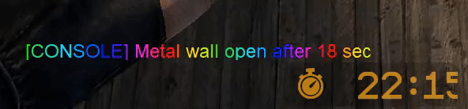
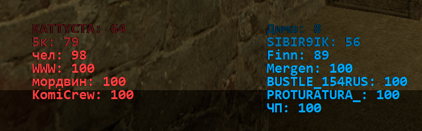
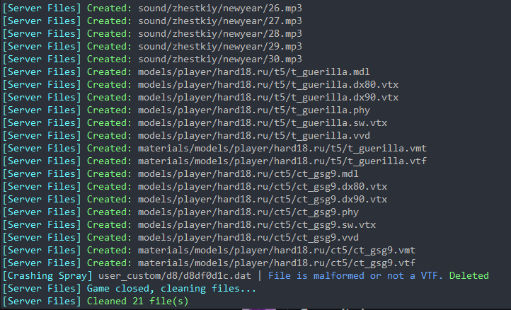

# source-engine-css-enhancer
# [EN]
***Author***: **Madness (null138)** | [Steam Profile](http://steamcommunity.com/profiles/76561198098349799)

[CS:S] Counter-Strike: Source Enhancer (CS:S Enhancer)

**CS:S Enhancer is an open‑source** Python tool that improves Counter‑Strike: Source gameplay by adding useful features and applying critical in‑game fixes.

**It designed to be fully safe and VAC‑friendly. It does not inject into the game process, does not write to or patch game memory, and does not modify the game executable. It only uses features available to ordinary players and operates by reading and editing text files the game already produces or consumes (for example logs and config files).**

***If you have any suggestions or ideas for new features, feel free to contact me. You can reach me via my Steam profile.***

**Note: Currently, there is no Linux support.**

**Installation:**
- Download the core and extract the archive to any folder.
- Set the game path exactly as it is (include the /cstrike folder) inside the css_enhancer_config.json config file next to the executable.
- On the first launch, wait for all modules to finish loading before launching the game.
- Keep the executable console open while playing, and close it only when you are done.
- It is recommended to launch the executable before starting the game.
- If for some reason the modules do not work, it may be because the autoexec is not applied by the game automatically. In that case, consider adding +exec autoexec.cfg to the game's launch parameters.

**Modules installation:**
- Download the compiled module from the repository, or compile it from the source code.
- Place the module and its files in the modules/ folder next to the executable.
- If the core executable is running, close it and launch it again.
- Some modules might not include config files. In that case, they will be generated after the first launch.
- After any changes to the modules or their configs, you need to close and relaunch the executable to apply the changes.

# Ready features

***[ANY] WinterFX | Snow on the ground:***
- Instantly transforms any map into a winter scene by replacing ground surfaces with snow-covered textures.

[Full information and guide](https://github.com/null138/source-engine-css-enhancer/tree/main/src_modules/WinterFX#readme)

***[ZE] Map action Countdown HUD***:
- Starts a real‑time countdown on screen whenever a map triggers a timed action.

[Full information and guide](https://github.com/null138/source-engine-css-enhancer/tree/main/src_modules/Countdown%20HUD#en)

***[ANY] Player info overlay***:
- Displays players names and health on screen and ranks players from lowest → highest health for both teams in real time. Works even while you are alive — purely a gameplay feature exposed by the game.

[Full information and guide](https://github.com/null138/source-engine-css-enhancer/tree/main/src_modules/Players%20List%20HUD)

***[ANY] Spray crash prevention***:
- Detects and removes crashing sprays uploaded by other players, preventing those sprays from crashing your client. (Note: a new exploit was discovered by the project author that servers cannot protect against — this feature protects the local client.)

[Full information and guide](https://github.com/null138/source-engine-css-enhancer/blob/main/src_modules/Spray%20Checker/README.md#en)

***[ANY] FastDL Fallback***:
- If you encounter **"Missing map maps/map.bsp, disconnecting"**, the module will attempt to download the required map from available FastDL services.
- If you encounter **"Your map maps/map.bsp differs from the server's"**, the module will delete that map and attempt to download the correct version from available FastDL services.

[Full information and guide](https://github.com/null138/source-engine-css-enhancer/tree/main/src_modules/FastDL%20Fallback#en)

***[ANY] Server Files***:
- Monitors and logs files downloaded from the server in real time, printing them to the core console.
- Optionally, based on the configuration, the script can automatically clean downloaded files either from the current session when you close the game or perform a full cleanup of all previously downloaded files on the script launch.

# Partially ready

***[ANY] Fake / Mirror server remover (full code for both host and local tool are ready)***:
- Removes fake or redirecting servers from your in‑game server browser. This feature requires a trusted central feed to detect and blacklist those servers accurately.

**To make the Fake/Mirror server remover fully functional we need a trusted, reliable host to run the central scanning script that:**

**Queries the Steam master server(s) for every active servers.**

**Detects fake/redirecting servers in real time and uploads them as list.**

**Publishes a verified blacklist feed (API or JSON) that local CS:S Enhancer instances can consume in real time.**

***[ANY] Auto Mini-Radar***:

- Automatically generates a mini-radar for every map (the one displayed in the top-left corner of the screen in-game).

- Uses layered highlighting instead of the standard flat top-down 2D view.

**Still in early development — radar quality and accuracy will continue to improve.**

# [RU/РУССКИЙ]
***Автор***: **Madness (null138)** | [Профиль Steam](http://steamcommunity.com/profiles/76561198098349799)

[CS:S] Counter-Strike: Source Enhancer (CS:S Enhancer)

**CS:S Enhancer — это инструмент с открытым исходным кодом**, написанный на Python, который улучшает игровой процесс Counter-Strike: Source, добавляя полезные функции и применяя критические исправления игры.

**Он создан как полностью безопасный и VAC-дружественный. Он не внедряется в процесс игры, не записывает и не изменяет память игры, а также не модифицирует исполняемый файл игры. Он использует только функции, доступные обычным игрокам, и работает, читая и изменяя текстовые файлы, которые игра уже создаёт или использует (например, логи и конфиги).**

***Если у вас есть пожелания или идеи по новым функциям, можете смело обращаться ко мне. Связаться со мной можно через мой профиль Steam.***

**Примечание: В настоящий момент поддержка Linux отсутствует.**

**Установка:**
- Скачайте ядро и распакуйте архив в любую папку.
- Укажите путь к игре точно так, как он есть (включая папку /cstrike) в конфигурационном файле css_enhancer_config.json рядом с исполняемым файлом.
- При первом запуске дождитесь завершения загрузки всех модулей перед запуском игры.
- Держите консоль исполняемого файла открытой во время игры и закрывайте её только после завершения игры.
- Рекомендуется запускать исполняемый файл перед запуском игры.
- Если по какой-то причине модули не работают, возможно, игра автоматически не применяет autoexec. В этом случае добавьте +exec autoexec.cfg в параметры запуска игры.

**Установка модулей:**
- Скачайте скомпилированный модуль из репозитория или скомпилируйте его из исходного кода.
- Поместите модуль и его файлы в папку modules/ рядом с исполняемым файлом.
- Если основной исполняемый файл запущен, закройте его и запустите снова.
- Некоторые модули могут не содержать конфигурационных файлов. В этом случае они будут сгенерированы после первого запуска.
- После любых изменений в модулях или их конфигурациях необходимо закрыть и снова запустить исполняемый файл, чтобы применить изменения.

# Готовые функции

***[ANY] WinterFX | Снег на поверхности земли***:
- Мгновенно превращает любую карту в зимнюю сцену, заменяя поверхности земли на покрытые снегом текстуры.

[Полная информация и руководство](https://github.com/null138/source-engine-css-enhancer/tree/main/src_modules/WinterFX#ru)

***[ZE] Map action Countdown HUD***:
- Запускает **реальный таймер обратного отсчёта** на экране каждый раз, когда карта активирует таймерное событие.

[Полная информация и руководство](https://github.com/null138/source-engine-css-enhancer/tree/main/src_modules/Countdown%20HUD#ru)

***[ANY] Player info overlay***:
- Отображает **имена игроков** и их **здоровье** на экране, сортируя их от самого низкого к самому высокому здоровью для обеих команд в реальном времени. Работает даже когда вы живы — это чисто внутриигровая функция, оставленная разработчиками.

[Полная информация и руководство](https://github.com/null138/source-engine-css-enhancer/tree/main/src_modules/Players%20List%20HUD#ru)

***[ANY] Spray crash prevention***:
- Обнаруживает и удаляет крашащие спреи, загруженные другими игроками, предотвращая вылет клиента.  
  (Примечание: автором проекта был обнаружен новый эксплойт, от которого серверы не могут защититься — эта функция защищает локального игрока.)

[Полная информация и руководство](https://github.com/null138/source-engine-css-enhancer/blob/main/src_modules/Spray%20Checker/README.md#ru)
  

***[ANY] FastDL Fallback***:
- Если появляется сообщение **"Missing map maps/map.bsp, disconnecting"**, модуль попытается скачать нужную карту с доступных сервисов FastDL.
- Если появляется сообщение **"Your map maps/map.bsp differs from the server's"**, модуль удалит эту карту и попытается скачать корректную версию с доступных сервисов FastDL.

[Полная информация и руководство](https://github.com/null138/source-engine-css-enhancer/tree/main/src_modules/FastDL%20Fallback#ru)
  

***[ANY] Server Files***:
- Отслеживает и логирует файлы, загружаемые с сервера в реальном времени, выводя их в консоль ядра.
- Опционально, в зависимости от настроек, скрипт может автоматически очищать загруженные файлы: либо только из текущей игровой сессии при закрытии игры, либо выполнять полную очистку всех ранее загруженных файлов при запуске модуля.

# Частично готово

***[ANY] Fake / Mirror server remover (полный код для хоста и локального инструмента готов)***:
- Удаляет фейковые или перенаправляющие серверы из внутриигрового серверного браузера.  
  Для корректной работы этой функции требуется надёжный центральный источник данных, который будет обнаруживать и блокировать такие серверы.

**Чтобы сделать модуль Fake/Mirror server remover полностью функциональным, нам нужен надёжный хост, который будет запускать центральный скрипт сканирования, выполняющий следующее:**

**Запрашивает мастер-сервер(а) Steam для получения списка всех активных серверов.**

**В реальном времени обнаруживает фейковые / перенаправляющие серверы и загружает их в виде списка.**

**Публикует проверенный чёрный список (в виде API или JSON), который локальные экземпляры CS:S Enhancer смогут использовать в реальном времени.**

***[ANY] Auto Mini-Radar***:

- Автоматически генерирует мини-радар для каждой карты (тот, что отображается в левом верхнем углу экрана в игре).

- Использует послойную подсветку вместо стандартного плоского вида сверху.

**Находится на ранней стадии разработки — качество и точность радаров будут улучшаться.**

