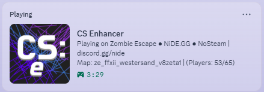

# [EN]
***[ANY] DiscordRPC***:
- Updates your Discord activity with the live game server you’re playing on, showing server name, map, player count, and a join button for friends.

**Warning:**
- Updates occur every 15 seconds to avoid spamming the server.
- The Join button shown under your status is not visible to you, only to other Discord users (this is a Discord side limitation).
- The elapsed time is unique to each server session and resets when you join a different server.
- It is currently known that after leaving a server, your Discord status may continue to display the last server you played on, even if you are no longer connected. Ignore or close the core application to stop this.
- This may be improved in the future once a reliable external method for detecting disconnections is found. We avoid interfering with the game process...

**Installation:**
- Place the module inside the modules folder.
- Run the core executable.
- Once the core console shows that it’s connected to Discord, you’re ready to join servers.

# [RU]
***[ANY] DiscordRPC***:
- Обновляет вашу активность в Discord с информацией о сервере, на котором вы играете, показывая название сервера, карту, количество игроков и кнопку для присоединения друзей.

**Внимание:**
- Обновления происходят каждые 15 секунд, чтобы не перегружать сервер.
- Кнопка "Присоединиться", отображаемая под вашим статусом, видна только другим пользователям Discord (это ограничение со стороны Discord) и не видна вам.
- Отсчёт времени уникален для каждой сессии сервера и сбрасывается при переходе на другой сервер.
- В настоящее время известно, что после выхода с сервера ваш статус в Discord может продолжать отображать последний сервер, на котором вы играли, даже если вы больше не подключены. Игнорируйте или закройте приложение ядра чтобы остановить это.
- Это может быть улучшено в будущем, когда будет найден надёжный внешний способ обнаружения отключений. Мы избегаем вмешательства в игровой процесс...

**Установка:**
- Поместите модуль в папку modules.
- Запустите исполняемый файл ядра.
- Когда консоль core покажет, что подключение к Discord установлено, вы готовы присоединяться к серверам.
